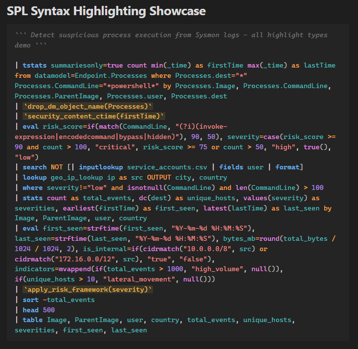

# SPL Syntax Highlighting

Syntax highlighting for Splunk Processing Language (SPL) in Obsidian code blocks.



## Features

- Full SPL syntax highlighting with 11 token types: commands, functions, keywords, operators, strings, numbers, fields, macros, comments, pipes, and brackets
- Context-aware highlighting — commands only highlighted after `|`, functions only when called with `()` or inside stats commands
- Light and dark theme support
- Word wrapping in code blocks
- Works in both Live Preview and Reading view

## Usage

Use `spl` or `splunk` as the language identifier in fenced code blocks:

    ```spl
    | search index=main sourcetype=syslog
    | stats count by host
    | sort -count
    | head 10
    ```

### SPL Comments

SPL uses triple backticks for comments. Since this conflicts with Markdown fences, use 4+ backtick fences when your SPL contains comments:

    ````spl
    ``` This is an SPL comment ```
    | search index=main
    ````

### Macros

Macros wrapped in backticks are highlighted:

    ```spl
    | `my_macro(arg1, arg2)`
    ```

## Highlighted Token Types

| Token | Examples | Color (light/dark) |
|-------|---------|-------------------|
| Commands | `search`, `stats`, `eval`, `where` | Blue |
| Functions | `count()`, `avg()`, `if()`, `len()` | Magenta |
| Keywords | `as`, `by`, `and`, `or`, `not`, `true` | Orange |
| Operators | `=`, `!=`, `>=`, `<`, `+`, `-` | Orange |
| Strings | `"value"`, `'value'` | Red |
| Numbers | `42`, `3.14`, `1.5e10` | Purple |
| Fields | `src_ip`, `user`, `_time` | Teal |
| Macros | `` `macro_name` `` | Gold |
| Comments | ```` ``` comment ``` ```` | Gray italic |
| Pipes | `\|`, `,` | Dark gray bold |
| Brackets | `()`, `[]` | Dark gray |

## Installation

### Manual
1. Download the latest release
2. Extract into your vault's `.obsidian/plugins/spl-syntax-highlighting/` directory
3. Enable the plugin in Settings > Community plugins

### Community Plugins
Search for "SPL Syntax Highlighting" in Settings > Community plugins > Browse.
